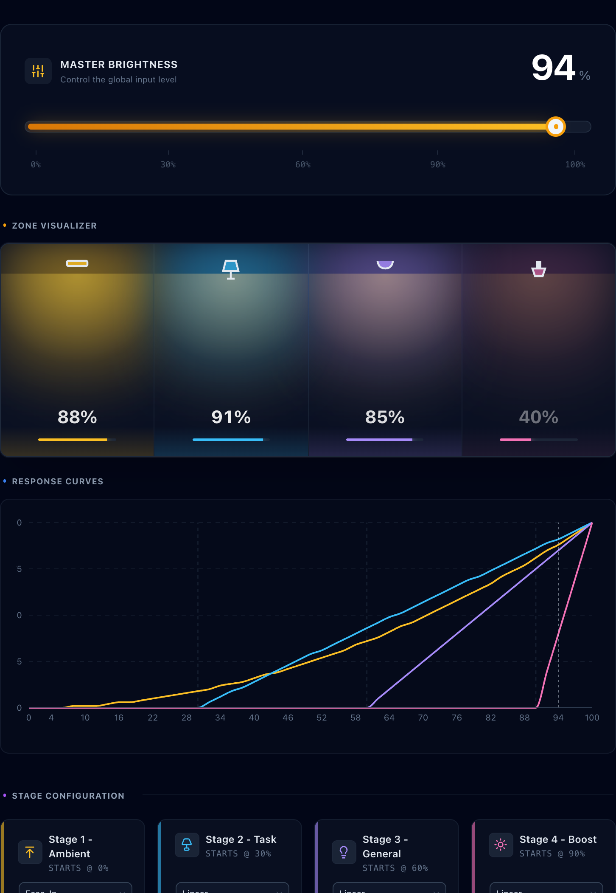

# Combined Lights

A Home Assistant custom component that creates a single unified light entity that intelligently controls multiple light zones based on brightness stages. Perfect for creating sophisticated lighting scenes that gradually expand throughout your home as you increase the brightness.

### Interactive Visualizer

Want to see exactly how your lights will behave? Check out the [Interactive Visualizer](https://recallfx.github.io/combined_lights/) to experiment with different curves and see how the stages activate across the brightness range.



## Overview

Combined Lights transforms your collection of individual lights into a cohesive lighting system. Set one brightness level, and watch as different zones of lights activate and adjust their brightness based on your configured stages and ranges.

The integration creates stages based on fixed brightness breakpoints at 30%, 60%, and 90%, dividing the brightness range into four progressive zones. Each zone activates at its corresponding breakpoint and brightens as overall brightness increases.

## Key Features

- **Zone-based Control**: Organize lights into 4 configurable stages/zones
- **Progressive Activation**: Lights activate in stages as overall brightness increases
- **Bidirectional Sync**: Wall switch changes automatically update the combined light brightness
- **Configurable Back-Propagation**: Optionally push manual adjustments to every stage to keep the scene aligned
- **Configurable Brightness Curves**: Each stage can use linear, quadratic, or cubic curves for precise control
- **Multiple Curve Types**: Linear, quadratic, or cubic brightness curves for fine-tuned control
- **Smart Context Awareness**: Distinguishes between manual changes and automation-driven adjustments
- **Native Home Assistant Integration**: Uses config flow for easy setup and reconfiguration

## How It Works

The integration divides the brightness scale (0-100%) into four progressive stages using fixed breakpoints at `[30, 60, 90]`:

- **Stage 1**: Active from 0% - Always on, brightens throughout entire range
- **Stage 2**: Activates at 30% - Brightens from 30% to 100%
- **Stage 3**: Activates at 60% - Brightens from 60% to 100%
- **Stage 4**: Activates at 90% - Brightens from 90% to 100%

Each stage uses a brightness curve (linear, quadratic, or cubic) to control how it brightens across its active range.

### Bidirectional Control

Combined Lights works both ways:

1. **Combined Light → Individual Lights**: When you adjust the combined light's brightness slider (or via automation), it calculates and applies the appropriate brightness to each zone based on your configuration.

2. **Wall Switches → Combined Light**: When you use physical wall switches or other controls to change individual lights, Combined Lights detects the changes and updates its own brightness to reflect the new state. This means other automations see the combined light as the control point, not the individual switches.

#### Back-Propagation vs Indicator-Only Updates

- **Indicator-Only (default)**: Manual tweaks simply adjust the combined light's reported percentage based on how many stages are active. For example, turning on only a Stage 4 light will display roughly 25%, preventing the slider from jumping straight to 100%.
- **Back-Propagation Enabled**: Toggle the **“Sync Manual Changes”** option in the config flow if you want manual changes to immediately drive *all* relevant stages so the entire scene matches the inferred combined brightness.

This toggle provides the best of both worlds: calm indicator behavior by default and full scene correction when desired.

This bidirectional sync ensures your lighting state is always accurate, whether you control individual lights or use the combined entity.

### Example Configuration

**Scenario: Living Room**

- **Stage 1 (Ambient)**: `light.led_strip` (Quadratic Curve)
- **Stage 2 (Task)**: `light.reading_lamp` (Linear Curve)
- **Stage 3 (General)**: `light.ceiling_main` (Linear Curve)
- **Stage 4 (Boost)**: `light.corner_spot` (Linear Curve)

**Behavior:**
- **0-30%**: Only LED strip is on, ramping up gently.
- **30-60%**: Reading lamp turns on and brightens. LED strip continues to brighten.
- **60-90%**: Ceiling light turns on.
- **90-100%**: Corner spot turns on for maximum brightness.

## Installation

### HACS (Recommended)

1. Ensure you have [HACS](https://hacs.xyz/) installed
2. Add this repository as a custom repository in HACS
3. Search for "Combined Lights" and install
4. Restart Home Assistant

### Manual Installation

1. Download the latest release
2. Copy the `custom_components/combined_lights` folder to your Home Assistant's `custom_components` directory
3. Restart Home Assistant

## Configuration

### Simplified Setup

1. Go to **Settings** > **Devices & Services**
2. Click **Add Integration** and search for "Combined Lights"
3. **Step 1: Assign Lights**
   - Assign lights to each of the 4 stages (Stage 1 = Ambient, Stage 4 = Full Brightness)
4. **Step 2: Select Curves**
   - Choose a brightness curve for each stage:
     - **Linear**: Standard even response
     - **Quadratic**: More precision at low brightness (recommended for Stage 1)
     - **Cubic**: Maximum precision at low brightness

### Intelligent Defaults

The integration now uses intelligent defaults to handle brightness progression automatically:

- **Progressive Zones**: Stages activate sequentially as you increase brightness.
- **Breakpoints**: Defaults are `[30, 60, 90]`.
  - **Stage 1**: Active from 1% (Always on)
  - **Stage 2**: Activates at 30%
  - **Stage 3**: Activates at 60%
  - **Stage 4**: Activates at 90% (High brightness boost)

### Brightness Curves

- **Linear**: Even brightness distribution across the range. Good for standard bulbs.
- **Quadratic**: Slower ramp-up at low levels. Great for LEDs that are too bright at 1%.
- **Cubic**: Very slow ramp-up. Perfect for night lights or sensitive ambient strips.

## Understanding Bidirectional Sync

One of Combined Lights' most powerful features is its ability to sync in both directions. This creates a seamless experience whether you're using digital controls or physical wall switches.

### How It Works

When you flip a wall switch or use a physical dimmer to adjust individual lights:

1. **Detection**: Combined Lights monitors all configured light entities for state changes
2. **Calculation**: It performs a reverse calculation to determine what overall brightness percentage would produce the current state
3. **Update**: The combined light entity updates its brightness to match
4. **Transparency**: Other automations and components see this as a normal combined light adjustment

### Benefits

- **Single Source of Truth**: Automations can monitor just the combined light, not individual switches
- **No Manual Flags**: Other components don't need special logic to detect "manual" vs "automated" changes
- **Physical Controls Work**: Users can use familiar wall switches without breaking automation logic
- **Always Accurate**: The combined light brightness always reflects the actual state of your lights

### Example Scenario

You have an automation that turns on accent lighting when the combined light is below 30%:

```yaml
automation:
  - trigger:
      platform: numeric_state
      entity_id: light.combined_lights
      below: 30
    action:
      - service: light.turn_on
        target:
          entity_id: light.accent_lights
```

Without bidirectional sync, this automation would need to monitor multiple individual lights and handle manual intervention. With bidirectional sync, it just works—whether someone adjusts the combined light slider or flips a wall switch, the automation responds correctly.

## Usage Examples

### Progressive Home Lighting

```yaml
# Living room that expands from accent to full lighting
stage_1_lights: ["light.accent_strips"]
stage_2_lights: ["light.table_lamps"] 
stage_3_lights: ["light.ceiling_main"]
stage_4_lights: ["light.outdoor_patio"]

# Breakpoints: [30, 60, 90] for smooth transitions
```

### Office/Workspace Setup

```yaml
# Desk area that scales from monitor bias to full room
stage_1_lights: ["light.monitor_backlight"]
stage_2_lights: ["light.desk_lamp"]
stage_3_lights: ["light.office_ceiling"]
stage_4_lights: ["light.closet", "light.storage_room"]
```

### Bedroom Nighttime Routine

```yaml
# Gentle progression from night light to morning brightness
stage_1_lights: ["light.bedside_dim"]
stage_2_lights: ["light.dresser_lamp"]
stage_3_lights: ["light.bedroom_main"]
stage_4_lights: ["light.walk_in_closet"]

# Use cubic curve for very gentle low-light progression
brightness_curve: "cubic"
```

## Automation Integration

The combined light entity works seamlessly with all Home Assistant automations and controls:

```yaml
# Simple brightness control
service: light.turn_on
target:
  entity_id: light.combined_lights
data:
  brightness_pct: 45

# Morning routine
automation:
  - trigger:
      platform: sun
      event: sunrise
    action:
      - service: light.turn_on
        target:
          entity_id: light.combined_lights
        data:
          brightness_pct: 75
```

### Working with Wall Switches

When users control individual lights via wall switches or physical controls:

- Combined Lights automatically updates its brightness to match
- Other automations see the change as if the combined light was adjusted
- No "manual intervention" flags for other components to worry about

This makes Combined Lights the single source of truth for your lighting state, whether controlled digitally or physically.

## Events

The integration fires custom events for monitoring and debugging:

```yaml
# Listen for external changes (useful for debugging)
automation:
  - trigger:
      platform: event
      event_type: combined_light.external_change
    action:
      - service: notify.mobile_app
        data:
          message: "Light {{ trigger.event.data.entity_id }} detected external change"
```

Note: With bidirectional sync enabled, most wall switch changes will update the combined light's brightness rather than triggering external change events. External change events are primarily useful for debugging unexpected state changes.

## Troubleshooting

### Lights Not Responding

1. Verify all light entities exist and are controllable
2. Check Home Assistant logs for errors
3. Ensure lights are not controlled by conflicting automations

### Combined Light Brightness Not Updating from Wall Switches

1. Check that the lights are properly configured in their respective zones
2. Verify the lights support brightness reporting (check `brightness` attribute)
3. Look for log messages about brightness sync in Home Assistant logs
4. Ensure the change is significant enough (threshold is 5/255)

### Unexpected Brightness

1. Review your brightness ranges configuration
2. Check which stage the overall brightness falls into
3. Verify breakpoints align with your expected behavior
4. Test with different brightness curves (linear/quadratic/cubic)

### Performance Issues

1. Avoid controlling too many lights in a single zone
2. Use appropriate timeouts for slow-responding lights
3. Consider splitting complex setups into multiple combined light entities
4. Check for feedback loops if using multiple automation layers

## Advanced Usage

### Architecture

The integration uses a modular helper package structure for clean separation of concerns:

- **BaseCombinedLightsCoordinator**: Abstract base class containing core state management and brightness distribution logic
- **BaseBrightnessCalculator**: Abstract base class for brightness calculations and curve applications
- **BrightnessCalculator**: HA-specific implementation using ConfigEntry
- **ZoneManager**: Manages light zones and their configuration
- **LightController**: Controls actual light state changes
- **ManualChangeDetector**: Detects manual interventions vs. automated changes

The base classes (`base_coordinator.py`) are independent of Home Assistant and can be reused by standalone tools like the simulation server.

This modular design makes the codebase maintainable, testable, and reusable.

### Understanding Brightness Curves

Each stage can use a different curve type to control how it brightens:

#### Ease-In Curves (Gentle Start)
- **Ease-In Strong (Cubic)**: Very gentle start, strong acceleration
  - `progress = x³`
  - Example: 50% progress = 12.5% brightness
  - **Use case**: Night lights, ambient strips requiring very gentle low-light control

- **Ease-In (Quadratic)**: Gentle start, moderate acceleration
  - `progress = x²`
  - Example: 50% progress = 25% brightness
  - **Use case**: LED strips that are too bright at low levels

#### Linear (Even Response)
- **Linear**: Even response across the range
  - `progress = x`
  - Example: 50% progress = 50% brightness
  - **Use case**: Standard bulbs, general-purpose lighting

#### Ease-Out Curves (Quick Start)
- **Ease-Out (Square Root)**: Quick start, gentle slowdown
  - `progress = √x`
  - Example: 50% progress = 71% brightness
  - **Use case**: Task lighting that needs to reach useful brightness quickly

- **Ease-Out Strong (Cube Root)**: Very quick start, strong slowdown
  - `progress = ∛x`
  - Example: 50% progress = 79% brightness
  - **Use case**: Work lights, areas needing immediate high brightness

## Contributing

Contributions are welcome! Please check the [issues page](https://github.com/recallfx/combined_lights/issues) for known issues or feature requests.

## License

This project is licensed under the MIT License - see the [LICENSE](LICENSE) file for details.

## Support

- **Issues**: [GitHub Issues](https://github.com/recallfx/combined_lights/issues)
- **Discussions**: [Home Assistant Community](https://community.home-assistant.io/)

## Version History

- **2.7.0**: Added interactive visualizer, new brightness curves (Square, Cube), and documentation improvements
- **2.6.0**: Simplified configuration by removing advanced breakpoint flow and migration
- **2.5.0**: Removed explicit brightness range configuration in favor of intelligent defaults
- **2.4.0**: Major refactor with new helper modules, improved manual change detection, configurable back-propagation, and config entry reload support
- **2.2.0**: Added bidirectional brightness synchronization - wall switches now update combined light brightness
- **2.1.0**: Zone-based configuration and advanced brightness control
- **2.0.0**: Major rewrite with improved architecture and config flow
- **1.x**: Initial releases with basic functionality